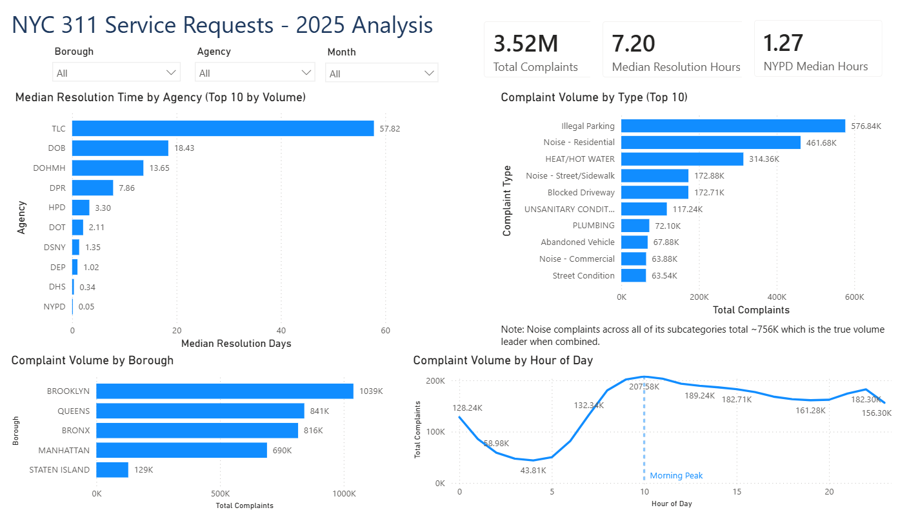
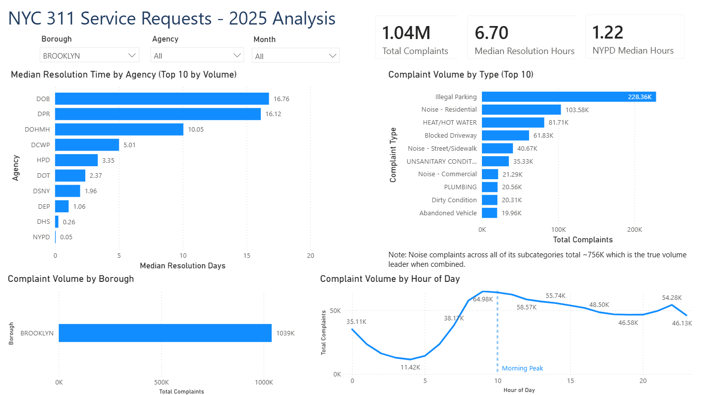
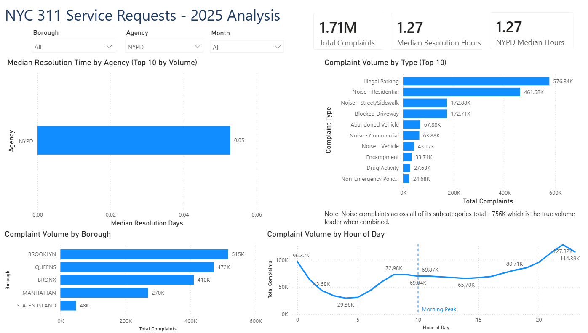
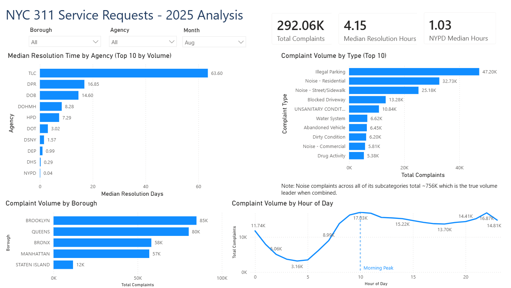

# NYC 311 Service Requests — Exploratory Data Analysis

An exploratory data analysis of about 3.6 million NYC 311 service
requests filed in 2025 using pandas. The notebook encompasses going through 
loading and cleaning the data, identifying any data quality issues, and 
answering questions about resolution times, agency patterns, and complaint volumes.

## Headline findings

- NYPD handles 49% of all complaints and closes them in a median of 1.3 hours which is more than the next 4 agencies combined
- Resolution times are bimodal: quick police responses (under 2 hours) and formal housing processes (about 1 month)
- Noise complaints are the true leader in volume at about 756,000 when combining subcategories, beating Illegal Parking's 577,000
- Complaint patterns follow the rhythms of daily city life - morning peaks, evening noise spikes, and weekday dominance

## Setup

Install the following dependencies:

    pip install pandas pyarrow matplotlib seaborn

You'll also need the dataset itself. It's too large for GitHub, so go here:

1. Download from [NYC Open Data](https://data.cityofnewyork.us/Social-Services/311-Service-Requests-from-2020-to-Present/erm2-nwe9/data_preview)
2. Filter to 2025 in the portal before exporting
3. Save it as `311_Service_Requests_from_2020_to_Present_20260620.csv`
   (or update CSV_PATH at the top of the notebook)

First run takes 60-90 seconds to load and cache the CSV as parquet.
Subsequent runs load in 1-2 seconds from the cache.

## What's in here

- `nyc_311_service_requests_analysis.ipynb` — the main notebook
- `nyc_311_service_requests_analysis.py` — same content as a python file (for git diffs)

## Questions answered

1. How fast do things get resolved?
2. Who handles the complaints?
3. What do people in NYC complain about?
4. What happens where?
5. When are complaints filed?

## Tools used

Python, pandas, NumPy, matplotlib, seaborn, pyarrow

## About

Built as a portfolio project while exploring data analytics. 
GitHub: [LittleJC3](https://github.com/LittleJC3)

## Power BI Dashboard

An executive dashboard built in Power BI summarizing the key findings 
from the Python EDA, with interactive slicers for Borough, Agency, 
and Month.

### Overview

### Filtered Views
**Brooklyn Borough**

**NYPD Agency**

**August Month**

> Filtering to NYPD alone reveals that the morning complaint peak 
> disappears entirely and is replaced by an evening spike driven by noise 
> complaints. The dashboard makes the relationship between agency type 
> and time patterns immediately visible.
